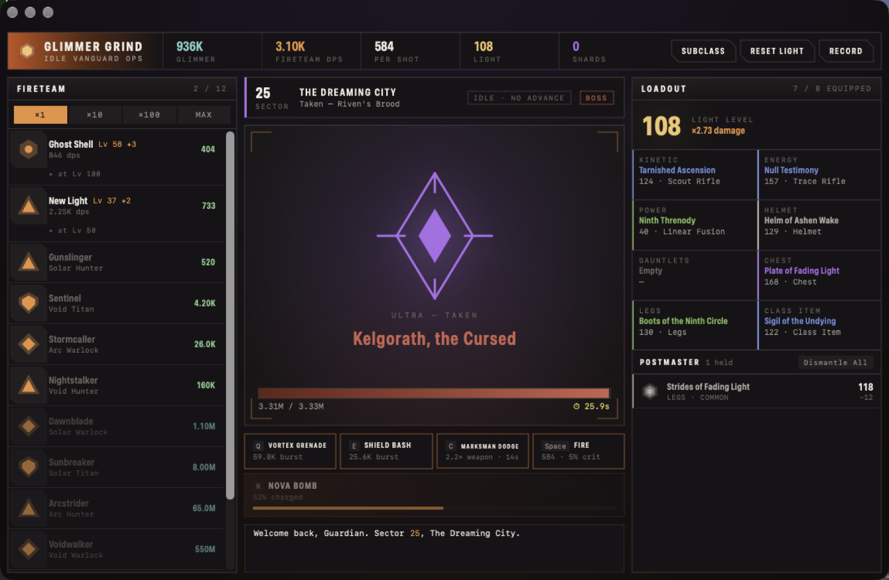

# Glimmer Grind

An idle looter-shooter for macOS — Clicker Heroes progression wearing a
Destiny-flavoured HUD. Farm sectors, build a fireteam, chase engrams, reset your
Light for shards, repeat.

Written in SwiftUI. No dependencies — every sigil, class mark, engram and the
app icon are drawn from vector paths in code.



---

> ### Unofficial fan project
>
> Not affiliated with, endorsed by, or associated with **Bungie, Inc.**
> *Destiny* and *Destiny 2* are trademarks of Bungie, Inc.
>
> This is a fan-made tribute that borrows terminology and setting names for
> flavour. It contains **no Bungie assets** — no art, audio, code, or game data.
> All source code and artwork here is original and licensed under Apache 2.0;
> that license covers this project's own code, not any third-party trademarks it
> references. If Bungie would like this taken down or renamed, open an issue and
> it will be handled promptly.

---

## Build and run

Needs only the Swift command line tools (`xcode-select --install`), no Xcode:

```bash
./build-mac.sh              # → build/GlimmerGrind.app
./build-mac.sh --install    # → /Applications, registered with Spotlight
```

The script compiles with `swiftc`, generates the app icon, assembles the bundle
by hand and ad-hoc signs it. Roughly ten seconds from clean.

Requires macOS 14 or later.

## How it plays

Ten enemies per sector, a boss every fifth with a 30-second timer. Twelve
Guardians you hire and level on a `1.07^n` cost curve, each with ✦ upgrades at
levels 10/25/50/100/175/300 that double their output. Click damage scales off
fireteam DPS, so shooting stays worth doing deep into a run.

**Sectors only advance on kills you take part in.** Land a shot or an ability on
a target and that kill counts, even if the fireteam finishes it. Walk away and
the fireteam keeps killing, keeps banking glimmer and keeps pulling engrams —
but the front line holds where you left it. Auto-shots from Arc or Auto-Loader
deal damage without counting as participation, by design: progress is something
you do, not something you buy. The HUD says which state you're in.

Eight gear slots average into a **Light Level** that multiplies all damage.
Engrams roll rarity, power and perks; the Postmaster holds twelve and
auto-dismantles overflow. Three subclasses swap your passive and your whole
ability kit. At sector 100 you can **Reset Light** for Legendary Shards and
spend them across seven permanent upgrade tracks.

Keys — `Space` fire · `Q` grenade · `E` melee · `C` class ability · `R` super.

## Tests

```bash
./run-tests.sh
```

39 checks covering the progression curve, the participation rule, hiring,
loot rolls, abilities, prestige and save round-tripping. `Model/` has no SwiftUI
dependency, so the whole simulation runs headlessly in a CLI — no Xcode, no test
framework. The suite uses an explicit `check` rather than `assert`, because
`assert` is compiled out under `-O` and would silently pass everything.

## Layout

```
Sources/GlimmerGrind/
  GlimmerGrindApp.swift   @main — window scene and sizing
  Model/
    GameData.swift        all static content: destinations, guardians, loot tables
    Game.swift            @Observable engine: combat, loot, prestige, save/load
  Views/
    Theme.swift           palette, type roles, chamfered plate chrome
    Glyphs.swift          faction sigils, class marks, engrams — vector paths
    RootView.swift        top HUD + adaptive layout
    CombatView.swift      viewport, ability bar, damage numbers, ticker
    Panels.swift          fireteam roster, loadout, postmaster
    Sheets.swift          item inspect, subclass, reset, record
Tests/EngineTests.swift   headless engine tests
Tools/make-icon.swift     renders AppIcon.icns with CoreGraphics
web/glimmer-grind.html    a standalone browser build of the same game
```

Nothing under `Model/` imports SwiftUI, so the engine runs and tests headlessly.
Every proper noun in the game lives in `GameData.swift` — renaming the whole
setting is a one-file change that touches no logic.

## Design

Single dark theme by choice, not omission: warm graphite ground, cool
information colours, one ember accent running from `#D8441A` through `#FF8A3D`
to `#FFC46B`. Currencies are deliberately separated by hue — glimmer teal,
shards violet, Light gold — so none of them compete with the accent. The palette
shifts with your destination: each of the eight areas drives the viewport wash,
the ambient glow, and the enemy health bar.

## Contributing

Issues and pull requests welcome. Two things worth knowing:

- Balance changes should say which sector range they were tested at. The HP
  curve is `10 × (z − 1 + 1.55^(z−1))` and small exponent changes move the wall
  a long way.
- Keep `Model/` free of SwiftUI imports.

## License

[Apache 2.0](LICENSE) © 2026 Zev
